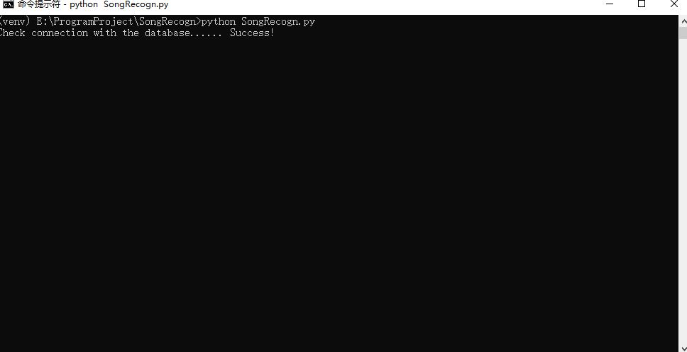
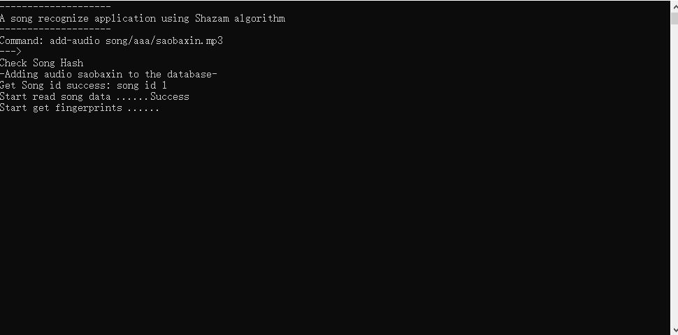
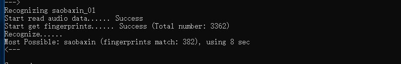

SongRecogn
==========

This is a song recognization program using shazam's algorithm.

[Paper](http://www.ee.columbia.edu/~dpwe/papers/Wang03-shazam.pdf)

If you want to see a explaination of how it works, check this out(chinese ver. only):[
Here](https://www.bilibili.com/read/readlist/rl54978)


## Setup
Make sure you install all dependency the requirements.txt

Change the sqlalchemy url in srModule/Config to your own database.

Create tables by using createDatabase.py

`python createDatabase.py`

*Change the config of mysql to reach a higher performance*

## Quickstart
```
cd SongRecogn
python SongRecogn.py
```

waiting for program connect to the data base.

then you will see a console.

```
add-audio : add a audio to the database
           usage :add-audio song/lingyu.mp3
add-dir : add audio from a directory
         usage :add-audio song
recognize : recognzie a audio sample from file
           usage :recognzie sample/lingyu_01.mp3
help : show help
quit : Quit
```

type the command to use the console.





If you want to use it directly in script.

```
from srModule import Console
Console.addAudio("song/linagyu.mp3")
Console.recognizeAudio("songp/liangyu_06.mp3")
Console.addAudioFromDir("song")
```

## ABC
3 sec of sample audio already have a very higher accuracy.
The longersample audio are, the longer time it costs for recognizing.


## Thanks

Thanks:

[dejavu](https://github.com/worldveil/dejavu)